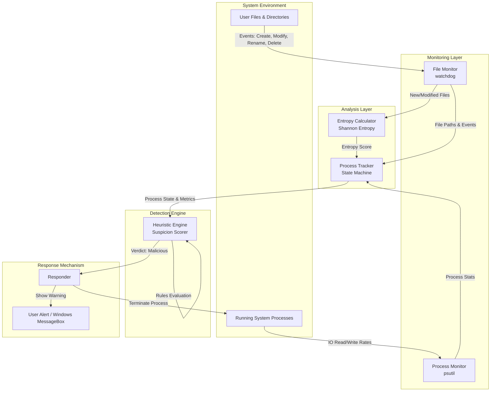
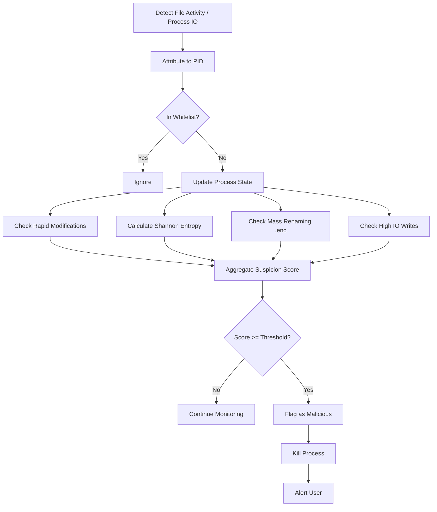

# CryptoWarden 🛡️

**CryptoWarden** is an early-stage, behavioral-based ransomware detection and prevention system written in Python.

Unlike traditional antivirus software that relies on static malware signatures, CryptoWarden actively monitors your system in real-time for the anomalous behavior patterns typical of zero-day crypto-malware. It utilizes a combination of file system monitoring, process tracking, mathematical entropy analysis, and heuristic scoring to detect and neutralize threats before they can compromise your data.

---

## 🚀 Key Features

- **Behavioral Heuristics:** Detects rapid file modifications, mass extension renaming (e.g., appending `.enc`), and abnormal I/O write bursts.
- **Mathematical Entropy Analysis:** Analyzes files on the fly using Shannon Entropy to detect the high level of randomness characteristic of encrypted data.
- **Active Mitigation:** Automatically terminates malicious processes (`psutil.kill`) before they can encrypt the rest of your system.
- **Whitelist Protection:** Prevents catastrophic system failure by explicitly allowing core OS functions (like `svchost.exe` and `explorer.exe`).
- **Resource Optimized:** Efficiently samples large files for entropy calculations rather than loading entire multi-gigabyte files into memory.

---

## 🏗️ Architecture Diagram

The system is designed with a clear separation of concerns, divided into distinct layers that handle monitoring, analysis, detection, and response.



---

## ⚙️ How It Works (Execution Flow)

The detection flow follows a strict heuristic pipeline to aggregate a suspicion score for each active process.



---

## 🧩 Project Modules Details

The system is highly modularized under the `src/` directory and connected via the `main.py` entry point.

### 1. Monitoring Layer (`src/monitoring`)

- **`file_monitor.py`**: Utilizes the `watchdog` library to implement real-time hooks on user directories (typically Documents, Desktop, Pictures). It tracks file system events (created, modified, deleted, moved/renamed). For modification and creation events, it attempts to attribute the change to a specific Process ID (PID).
- **`process_monitor.py`**: A fallback/supplementary monitor using `psutil`. It polls all running processes periodically to capture abnormal IO write bursts. This is crucial because ransomware could potentially bypass `watchdog` hooks or mask its file handles.

### 2. Analysis & Tracking Layer (`src/analysis`)

- **`process_tracker.py`**: Acts as a state machine. It maintains a `ProcessState` for each active PID handling files. It tracks timestamps of file modifications and renames (within sliding 10-second windows), entropy history of files written by this process, and overall IO write rates.
- **`entropy.py`**: Contains algorithms to calculate the **Shannon Entropy** of file data. Because ransomware encrypts files (resulting in high-entropy randomness), the tool checks if generated files exceed the `MAX_ENTROPY_THRESHOLD` (approx > 7.5). To maintain system performance on large files, it performs sampled reads (first, middle, and last 1KB).

### 3. Detection Engine (`src/detection`)

- **`engine.py`**: The core decision-making unit. It evaluates the `ProcessState` against a set of heuristic rules to calculate a *suspicion score*:
  - **Rule 1**: Rapid file modification bursts (Score +5).
  - **Rule 1.5**: Critical I/O write rate spikes (Score +10 for extreme, +3 for high).
  - **Rule 2**: High entropy writes suggesting encryption (Score +4).
  - **Rule 3**: Mass file extension renaming operations (Score +6).

  If the calculated score is `>= 6`, the process is flagged as **malicious**. The engine also cross-references against a whitelist to prevent system-crashing false positives.

### 4. Response Mechanism (`src/response`)

- **`responder.py`**: Upon receiving a malicious verdict, it takes immediate mitigating action. It forcibly terminates the offending process using `psutil`, effectively halting the encryption process before it can spread further. It then natively alerts the user via a Windows MessageBox (`ctypes.windll.user32`).

---

## 📁 Project Structure

```text
CryptoWarden/
│
├── src/
│   ├── config.py              # System configuration and thresholds
│   ├── main.py                # Entry point
│   ├── analysis/              # Entropy calculations and process tracking
│   ├── detection/             # Core decision engine for suspicion scoring
│   ├── monitoring/            # Watchdog file observers and process I/O polling
│   ├── response/              # Process termination and alerting
│   └── utils/                 # Logging and process/file mapping
│   
├── tests/
│   └── ransomware_simulator.py # Safe simulator to test the detection engine
│
├── project_analysis.md        # Technical architectural breakdown
├── requirements.txt           # Python dependencies
└── README.md
```

---

## 🛠️ Installation & Setup

1. **Clone the repository:**

   ```bash
   git clone https://github.com/yourusername/CryptoWarden.git
   cd CryptoWarden
   ```

2. **Install the dependencies:**

   It is recommended to run this inside a virtual environment.

   ```bash
   pip install -r requirements.txt
   ```

3. **Configure the system:**

   Review `src/config.py` to add or remove directories you wish to monitor or adjust the detection thresholds.

4. **Run the tool:**

   *Note: Administrative privileges might be required to trace and terminate certain processes effectively.*

   ```bash
   python -m src.main
   ```

---

## ⚠️ Testing the System

A simulator script is provided to safely test the detection engine without harming your actual files.

1. Run `python -m src.main` in one terminal (as Administrator for best results).
2. In a separate terminal, run `python tests/ransomware_simulator.py`.
3. The simulator will create a `RansomwareTestArea` folder on your Desktop, generate dummy files, and violently "encrypt" them by rapidly overwriting them with random bytes and renaming them to `.enc`.
4. CryptoWarden should quickly detect the behavior, flag the process, and terminate the simulator.

---

## 🔬 Technical Assessment

### Strengths

- **Behavioral Approach**: Inherently superior to signature-based AV for zero-day ransomware.
- **Optimized Parsing**: Uses smart heuristics such as sampling large files for entropy rather than loading entire gigabytes into RAM.
- **Multi-vector Indicators**: Checks both File System APIs (`watchdog`) and Process I/O counters (`psutil`), preventing malware from easily evading detection by disguising only one behavior.

### Limitations

- **User-Mode Tracing**: Attributing file events to processes via `psutil.process_iter` in a user-mode script is extremely resource-intensive and prone to race conditions. Real-world commercial solutions implement this via a **Kernel-mode File System Minifilter Driver** (in C/C++).
- **Latency Delay**: Python's garbage collection and global interpreter lock (GIL) might introduce micro-second latency blocks. Very fast ransomware (like LockBit) might successfully encrypt a substantial number of files before the heuristic score crosses the threshold and the process receives a termination signal.
- **Privilege Separation**: If the ransomware is running with `SYSTEM` privileges and the detector is in user-context, the kill signal will be met with `Access Denied`.

---

## 🛑 Disclaimer

This project is intended for **educational and research purposes only**. While it demonstrates effective behavioral indicators of modern ransomware, it is a user-mode Python application and should **not** replace enterprise security solutions (EDR/XDR) that utilize Kernel-level Minifilter drivers for absolute protection.
